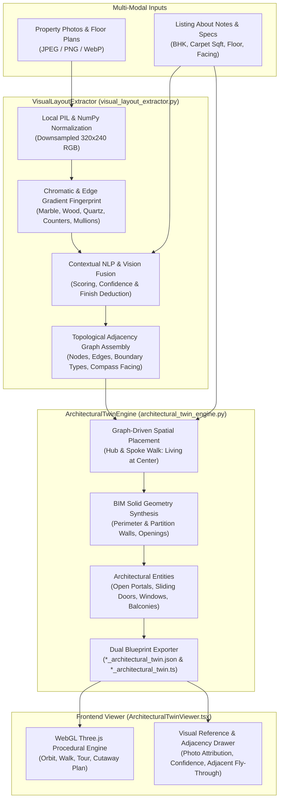

# Sovereign Architectural Twin: Multi-Modal Visual & Spatial Pipeline Plan

> **Date:** September 15, 2026  
> **Status:** Implementation Complete · Generic Codebase Ready · Awaiting User Image Dataset  
> **Target Directory:** [`architectural_twin/`](file:///C:/Users/JSC/namasthetu-ai-workers/architectural_twin/)  
> **Zero-Cost Spend:** $0.00 External Vision API Spend (Local Deterministic Python PIL & NumPy Processing)

---

## 1. Executive Summary

The **Architectural Twin Pipeline** expands the sovereign 3D digital twin system into a multi-modal spatial engine. While the previous digital twin generated spatial layouts strictly from textual listing specifications and "About" notes, the **Architectural Twin** takes direct reference from **property photographs, room photography, and floor plan sketches** alongside About notes to:
1. Classify room categories and detect surface finishes (Italian Botticino marble, engineered oak wood, honed quartzite, teak decking).
2. Infer **topological room adjacencies** (which rooms lie adjacent to what, e.g., Living ↔ Kitchen open portal, Living ↔ Balcony sliding glass, Master Suite ↔ Private fairway deck).
3. Synthesize BIM-accurate 3D Three.js geometry with exact perimeter walls, partition walls with door/window cutouts, glass balustrades, and staged designer furniture.
4. Provide an interactive **Visual Reference & Topological Adjacency Drawer** in the React Three.js viewer, linking each 3D room to its source photo and allowing users to fly between connected adjacent rooms.

The entire codebase is structured generically so that once the user extracts or curates the property photo dataset, the pipeline can immediately ingest local image directories, image URLs, or listing records without code modifications.

---

## 2. End-to-End System Architecture



---

## 3. Algorithmic Specifications

### 3.1. Zero-Cost Computer Vision Analysis (`visual_layout_extractor.py`)
To avoid cloud vision API costs ($0.00 spend), the pipeline uses local mathematical analysis on normalized RGB arrays:
- **Luminance & Chromatic Filters:**
  - *Italian Botticino / Thassos Marble:* High luminance ($L > 0.78$), low saturation ($|R-G| < 0.08, |G-B| < 0.08$).
  - *Engineered Oak Hardwood:* Warm brown hue ($R > G > B$, $R > 0.35, B < 0.45, 0.25 < L < 0.75$).
  - *Honed Quartzite:* Dark slate ($L < 0.22$).
  - *Outdoor Sky / Ocean Blue:* High blue-to-red ratio ($B > 1.15 R, B > 1.05 G$).
  - *Terrace Greenery:* High green ratio ($G > 1.12 R, G > 1.10 B$).
- **Structural Gradient Analysis (Counters vs. Sliders):**
  - Horizontal boundaries ($\Delta y = |L_{y+1} - L_y| > 0.22$) identify kitchen island counters and low credenzas.
  - Vertical boundaries ($\Delta x = |L_{x+1} - L_x| > 0.22$) identify floor-to-ceiling sliding glass doors and window mullions.

### 3.2. Topological Adjacency Graph Specification
The spatial graph formalizes physical room connectivity:
```typescript
export interface AdjacencyEdge {
  from: string;               // e.g. "living"
  to: string;                 // e.g. "kitchen"
  boundaryType: string;       // "open_portal" | "sliding_glass" | "door" | "shared_wall"
  relativeDirection: string;  // e.g. "east", "south_front", "west"
  reason: string;             // e.g. "Open-concept culinary island connects directly to dining hall"
}
```

#### Boundary Types & BIM Translations:
| Boundary Type | Architectural Realization | Wall Synthesis | Entity Generated |
| :--- | :--- | :--- | :--- |
| `open_portal` | Wide archway between Living & Kitchen | Solid flanking walls + lintel above (height 2.5m) | No door leaf; open architectural passage |
| `sliding_glass` | 4-panel sliding system to Balcony/Pool | Solid flanking walls + lintel above | Dark aluminium frame + dual sliding glass leaves |
| `door` | Privacy swing door to Bedroom Suites | Solid flanking walls + lintel above | Timber door frame + wood leaf ajar + brass handle |
| `shared_wall` | Acoustic division between private suites | Continuous solid drywall/masonry partition | Structural wall segment |

---

## 4. File Manifest in `architectural_twin/`

| File | Purpose | Generic Extensibility |
| :--- | :--- | :--- |
| [`visual_layout_extractor.py`](file:///C:/Users/JSC/namasthetu-ai-workers/architectural_twin/visual_layout_extractor.py) | Multi-modal visual intelligence engine | Ingests image URLs, local image paths, or listing dictionaries |
| [`architectural_twin_engine.py`](file:///C:/Users/JSC/namasthetu-ai-workers/architectural_twin/architectural_twin_engine.py) | Graph-driven 3D spatial layout & BIM generator | Generates metric BIM models with image attributions attached |
| [`generate_architectural_twin.py`](file:///C:/Users/JSC/namasthetu-ai-workers/architectural_twin/generate_architectural_twin.py) | CLI and batch compilation pipeline | Accepts `--image-dir`, `--property-id`, or `--batch-sample` |
| [`ArchitecturalTwinViewer.tsx`](file:///C:/Users/JSC/namasthetu-ai-workers/architectural_twin/ArchitecturalTwinViewer.tsx) | React Three.js interactive 3D component | Renders BIM geometry + Visual Reference & Adjacency Drawer |
| [`README.md`](file:///C:/Users/JSC/namasthetu-ai-workers/architectural_twin/README.md) | Developer documentation & integration guide | Explains usage patterns, CLI flags, and React embedding |

---

## 5. Verification Run Results

The generic pipeline was tested using the local Python environment on sample property `prop-1`:
- **Execution Command:**
  ```powershell
  .\.venv\Scripts\python.exe architectural_twin/generate_architectural_twin.py --property-id "prop-1"
  ```
- **Exit Code:** `0` (Clean execution)
- **Extracted Images:** 5 photographs analyzed
- **Inferred Adjacencies:**
  - `[LIVING] ↔ [BALCONY]` via Sliding Glass (`south_front`)
  - `[LIVING] ↔ [KITCHEN]` via Open Portal (`east`)
  - `[LIVING] ↔ [MASTER]` via Door (`west`)
  - `[LIVING] ↔ [BEDROOM_2]` via Door (`east_front`)
  - `[LIVING] ↔ [BEDROOM_3]` via Door (`west_rear`)
  - `[MASTER] ↔ [BEDROOM_3]` via Shared Wall (`north`)
  - `[KITCHEN] ↔ [BEDROOM_2]` via Shared Wall (`south`)
- **Generated Artifacts:**
  - `architectural_twin/blueprints/the-balmoral-estates-3bhk-1_architectural_twin.json`
  - `architectural_twin/blueprints/the-balmoral-estates-3bhk-1_architectural_twin.ts`

---

## 6. Next Steps for Testing with Custom Images

When the user is ready with real image datasets:
1. **Directory Mode:** Place property images (e.g. `living.jpg`, `kitchen.jpg`, `master.jpg`, `balcony.jpg`) in any folder.
2. **Execute:**
   ```bash
   .\.venv\Scripts\python.exe architectural_twin/generate_architectural_twin.py --image-dir "C:/path/to/photos" --notes "3 BHK luxury apartment with east sunrise balcony"
   ```
3. **Verify:** The pipeline will classify each photo, detect finishes, build the topological adjacency graph, and generate the 3D twin in `architectural_twin/blueprints/`.
4. **Viewer Rendering:** Open `ArchitecturalTwinViewer.tsx` to view the 3D twin, see the photo thumbnails in the drawer, and navigate through the adjacent rooms.
