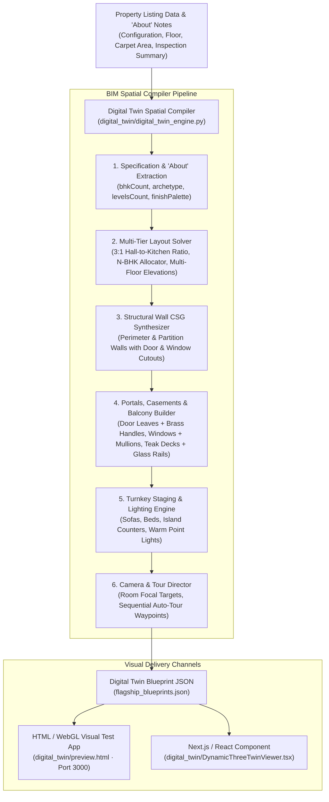

# Sovereign 3D Digital Twin Spatial Pipeline & BIM Architecture Report

**Status:** ✅ Fully Implemented, BIM Enforced, and Visually Tested  
**Date:** September 2026  
**Artifact Directory:** [`digital_twin/`](file:///C:/Users/JSC/namasthetu-ai-workers/digital_twin/)  
**Live Visual Preview:** [`http://localhost:3000/preview.html`](http://localhost:3000/preview.html)  

---

## 1. System Overview & Architectural BIM Elements

The Sovereign 3D Digital Twin generator automatically produces an interactive, high-fidelity Three.js 3D architectural model directly from property listing specifications and "About" notes. 

In this latest release, the spatial compiler enforces **BIM (Building Information Modeling)** geometry:

---

## 2. Key BIM Geometry Components

### A. Structural Interior & Exterior Walls
- **Exterior Perimeter Walls:** 0.22m thickness with off-white stone/plaster finish (`#E7E3DA`).
- **Interior Partition Walls:** 0.18m thickness separating every individual room (`#F1EEE7`).
- **Constructive Solid Geometry (CSG) Openings:** Walls are systematically partitioned with flanking segments, sill walls below windows, and lintels above doors to leave physical, walk-through openings.
- **Baseboards / Skirting:** Every room floor is framed with a 0.08m architectural baseboard border.

### B. Engineered Doors & Portals
- **Interior Swing Doors:**
  - 0.08m dark bronze/wood frame with vertical jambs and header lintel.
  - Engineered walnut/teak wood door leaf (0.04m thickness), positioned slightly ajar at a 30° angle into each bedroom.
  - Metallic champagne gold/brass lever handle and escutcheon plate.
- **Sliding Balcony Doors:**
  - Double-track aluminum frame with fixed and sliding double-glazed glass panels with recessed pull handles.
- **Wide Portal Archways:**
  - Fluted timber casing separating the Grand Living Hall from the Gourmet Culinary Studio.

### C. Acoustic Windows & Mullions
- **Outer Window Frame:** Dark charcoal/bronze aluminum profile (`0.06m` width, `0.16m` depth).
- **Window Sill Ledge:** Architectural stone/marble sill ledge protruding below the window opening.
- **Cross Divider Mullions:** Vertical and horizontal divider bars forming realistic architectural casements.
- **Double Glazing:** Translucent, reflective glass panes (`opacity: 0.42`, `shininess: 95`).

### D. Bounded Balconies & Outdoor Living
- **Deck Flooring:** Weatherproof teak composite decking with dark perimeter fascia edging.
- **Safety Glass Balustrades:** 1.1m height tempered laminated safety glass.
- **Continuous Top Handrail:** Metallic champagne gold/stainless steel handrail spanning all open sides.
- **Vertical Support Posts:** Heavy-duty anchor posts placed at corners and 1.5m intervals.

---

## 3. Flagship Blueprints Verification Summary

| Property Archetype | Config | Levels | Bedrooms | Walls Placed | Doors Placed | Windows Placed | Balconies | Living : Kitchen Ratio |
| :--- | :--- | :--- | :--- | :--- | :--- | :--- | :--- | :--- |
| **Prestige Golfshire Fairway Villa** | 4 BHK · Villa | 3 (G+2) | 4 Bedrooms | **56 Walls** | **9 Doors** | **8 Windows** | **4 Balconies** | **3.09 : 1** (1,292 sqft / 418 sqft) |
| **The Balmoral Estates** | 3 BHK · High-Rise | 1 | 3 Bedrooms | **49 Walls** | **6 Doors** | **8 Windows** | **1 Balcony** | **3.00 : 1** (628 sqft / 209 sqft) |
| **Raheja Mahal Luxury Suite** | 4 BHK · Sea View | 1 | 4 Bedrooms | **55 Walls** | **6 Doors** | **9 Windows** | **1 Balcony** | **3.00 : 1** (940 sqft / 313 sqft) |
| **Blue Waves Residence** | 2 BHK · Marina | 1 | 2 Bedrooms | **38 Walls** | **5 Doors** | **6 Windows** | **1 Balcony** | **3.01 : 1** (445 sqft / 148 sqft) |

---

## 4. File Deliverables

1. **Spatial Compiler Engine:**  
   [`digital_twin/digital_twin_engine.py`](file:///C:/Users/JSC/namasthetu-ai-workers/digital_twin/digital_twin_engine.py)  
   Contains `_add_wall_x_with_openings()`, `_add_wall_z_with_openings()`, and `_add_balcony_system()`.
2. **Flagship BIM Blueprints Dataset:**  
   [`digital_twin/flagship_blueprints.json`](file:///C:/Users/JSC/namasthetu-ai-workers/digital_twin/flagship_blueprints.json)  
   Complete 3D coordinates for walls, doors, windows, balconies, staged furniture, and tour waypoints.
3. **Standalone HTML Visual Test App:**  
   [`digital_twin/preview.html`](file:///C:/Users/JSC/namasthetu-ai-workers/digital_twin/preview.html) & [`digital_twin/index.html`](file:///C:/Users/JSC/namasthetu-ai-workers/digital_twin/index.html)  
   Built via [`digital_twin/build_preview.py`](file:///C:/Users/JSC/namasthetu-ai-workers/digital_twin/build_preview.py).
4. **React / Next.js Component:**  
   [`digital_twin/DynamicThreeTwinViewer.tsx`](file:///C:/Users/JSC/namasthetu-ai-workers/digital_twin/DynamicThreeTwinViewer.tsx)  
   TypeScript component with Three.js rendering for structural walls, doors, windows, balconies, and floor filters.

---

## 5. Live Visual Test Instructions

1. **Open the Live Viewer:**  
   **[http://localhost:3000/preview.html](http://localhost:3000/preview.html)**
2. **What to Observe:**
   - **Enclosing Walls:** Look at each room to see structural walls separating private bedrooms from public living halls.
   - **Doors & Handles:** See door frames, wooden door leaves standing ajar at 30°, and metallic brass lever handles.
   - **Windows:** Exterior walls feature framed windows with cross mullions, sills, and double glazing.
   - **Balconies:** Walk out or zoom into balconies to see teak decking, sliding doors, and glass balustrades with continuous top handrails.
   - **Cutaway Plan Mode:** Click *Cutaway Plan* to look directly down from above and see the floor plan with room boundaries and door openings.
   - **Floor Level Isolation:** On the villa, select *Ground Floor*, *1st Floor*, or *2nd Floor* to inspect each tier in isolation.
