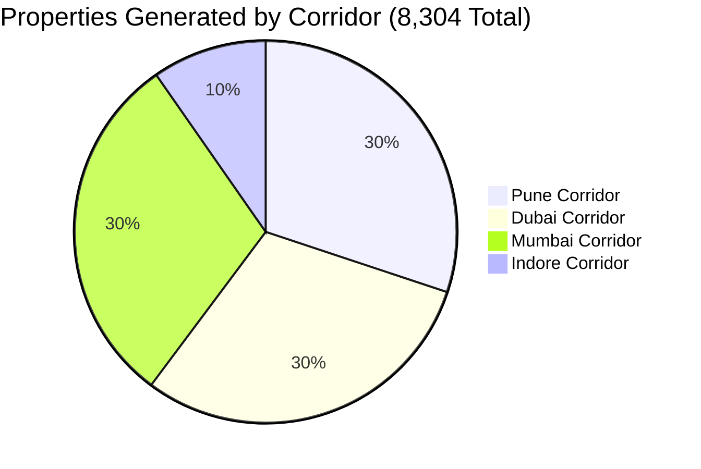

# Mock Properties & Database Seed Generation Report (8,304 Listings)

**Corridors:** Pune, Dubai, Mumbai, Indore  
**Data Shape Reference:** [`DOCS/mockProperties.ts`](file:///C:/Users/JSC/namasthetu-ai-workers/DOCS/mockProperties.ts)  
**Output Formats:** TypeScript (`.ts`), PostgreSQL + PostGIS Seed (`.sql`), JSON Seed (`.json`)  
**Status:** ✅ Complete across all 4 separate corridor folders and unified master datasets  
**Spend:** **$0.00** (Zero Google Maps / Places API cost)  

---

## 1. Executive Summary

Using the 8,304 sovereignly extracted and deduplicated luxury societies from the four urban corridors (Pune, Dubai, Mumbai, Indore), we generated high-fidelity property listings conforming strictly to the frontend and data contract established in [`DOCS/mockProperties.ts`](file:///C:/Users/JSC/namasthetu-ai-workers/DOCS/mockProperties.ts).

Each corridor now possesses its own isolated folder with:
1. **TypeScript Dataset (`*.ts`)**: Strongly typed against `PropertyListing` with full spatial rooms, 80-point civil inspection audits, AVM valuations, deed histories, verified owner profiles, and curated luxury media.
2. **PostgreSQL / PostGIS Seed (`*.sql`)**: Production-ready SQL DDL and `INSERT ... ON CONFLICT` statements storing spatial geometries (`ST_SetSRID(ST_MakePoint(lng, lat), 4326)`) and JSONB columns for sub-objects.
3. **JSON Seed (`*.json`)**: Machine-readable format for ingestion by Next.js API routes, Prisma seeders, or backend microservices.

In addition, consolidated master files containing all 8,304 properties were generated in both [`data_fetch/`](file:///C:/Users/JSC/namasthetu-ai-workers/data_fetch) and [`DOCS/`](file:///C:/Users/JSC/namasthetu-ai-workers/DOCS).

---

## 2. Field-by-Field Mapping Architecture

| Field | Source Type | Extraction / Synthesis Rule | Example |
| :--- | :--- | :--- | :--- |
| `id` | Synthetic ID | Formatted ID `prop-1` to `prop-8304` | `"prop-1"` |
| `slug` | Derived | URL-safe slug from normalized society name + BHK + ID | `"the-balmoral-estates-3bhk-1"` |
| `societyId` | **Ground Truth** | Original extracted UUID from master societies dataset | `"cbfc3afc-d7bf-4e65-945f-accb2761ba10"` |
| `title` | Hybrid | Extracted society name + realistic luxury floor/view descriptor | `"The Balmoral Estates 3 BHK with Sunrise Facing Balcony & 3D Twin"` |
| `locality` | **Ground Truth** | Extracted `micro_market` | `"Baner & Pan Card Club Rd"` |
| `city` | **Ground Truth** | Extracted `city` | `"Pune"`, `"Dubai"`, `"Mumbai"`, `"Indore"` |
| `state` | **Ground Truth** | State derived from corridor geography | `"Maharashtra"`, `"Dubai Emirate"`, `"Madhya Pradesh"` |
| `coordinates` | **Ground Truth** | Extracted rooftop `latitude` and `longitude` | `{ lat: 18.566595, lng: 73.7753 }` |
| `listingMode` | Synthetic | 85% "BUY", 15% "RENT" | `"BUY"` / `"RENT"` |
| `category` | Synthetic | Dynamic category tags (`DIRECT_OWNER`, `DIGITAL_TWIN`, `WATERFRONT`, `VILLAS_PLOTS`, etc.) | `["DIRECT_OWNER", "DIGITAL_TWIN", "TRUST_PASS_ELITE"]` |
| `propertyType` | Hybrid | Normalized from `property_type` (Apartment, Penthouse, Villa) | `"Apartment"`, `"Penthouse"`, `"Villa"` |
| `configuration` | Synthetic | Realistic BHK configuration weighted by corridor | `"2 BHK"`, `"3 BHK"`, `"4 BHK"`, `"5 BHK"` |
| `bathrooms` | Synthetic | Realistic bath count matching configuration | `2`, `3`, `4`, `5` |
| `carpetAreaSqft` | Synthetic | Realistic carpet area based on configuration | `1,071` to `4,200` sq.ft |
| `superBuiltUpAreaSqft`| Derived | `carpetAreaSqft * 1.25–1.32` loading ratio | `1,402` to `5,200` sq.ft |
| `floor` | Hybrid | Real `levels` from OSM tags formatted with ordinals | `"15th of 16 Floors"`, `"G + 2 Independent Villa"` |
| `facing` | Synthetic | Vastu / Feng Shui compliant orientations | `"East"`, `"North-East"`, `"South-East"`, `"West"` |
| `waterSupply` | Corridor Native | Real municipal supply + filtration infrastructure | `"PMC High-Pressure Direct + Water Softening Plant"`, `"DEWA Potable Grid + Dual Chiller Loop"` |
| `pricePaise` | Corridor Native | Calculated from local market per-sqft rate (INR paise / AED fils) | `"3623121600"` (₹3.62 Cr) / `"321924000"` (AED 3.21M) |
| `formattedPrice` | Corridor Native | Formatted currency string | `"₹3.62 Cr"`, `"AED 3,219,240"`, `"₹2.21 L / mo"` |
| `pricePerSqft` | Corridor Native | Per-sqft market rate | `"₹19,029 / sq.ft"`, `"AED 1,930 / sq.ft"` |
| `maintenanceMonthlyPaise` | Derived | Monthly society maintenance in paise / fils | `"1461100"` (₹14,611/mo) |
| `stampDutyEstimate` | Corridor Native | Stamp duty calculation (MH 6%, MP 7.5%, Dubai 4% DLD) | `"₹21.74 L (6%)"`, `"AED 128,769 (4% DLD Transfer Fee)"` |
| `registrationEstimate` | Corridor Native | Municipal registration / trustee fee | `"₹30,000"`, `"AED 4,000 (DLD Trustee Fee)"` |
| `images` | Curated Pool | 5 high-resolution luxury architectural photos (exterior, living, bedroom, kitchen, deck) | Array of 5 Unsplash architecture URLs |
| `has3dTour` | Synthetic | Matterport / WebGL 3D Spatial Twin availability | `true` |
| `spatialRooms` | Synthetic | 4 detailed spatial zones with dimensions, materials & colors | `Living`, `Master Suite`, `Gourmet Kitchen`, `Sky Balcony` |
| `trustScore` | Derived | Verified structural composite score (94–99) | `97` |
| `verifiedOwnerBadge` | Synthetic | Direct owner verification status | `true` |
| `topBadge` | Derived | Contextual badge derived from society name & luxury tier | `"Owner Direct · The Balmoral Estates"` |
| `ulpin` | **Ground Truth/Cadastral** | Official Makani number (Dubai) or 14-digit state ULPIN (MH/MP) | `"71124 28697"` (Dubai), `"2725-1665-8190-31"` (MH) |
| `reraNumber` | **Ground Truth** | Extracted MahaRERA, DLD Project ID, or MP RERA | `"P52100013608"`, `"DLD-PRJ-92724"`, `"P-IND-00068385"` |
| `availableFrom` | Synthetic | Occupancy status | `"Immediate / Ready to Move"`, `"Within 15 Days"` |
| `inspection` | Synthetic (80-pt) | Civil audit with engineering firm, rebound hammer, thermal moisture, and RCCB scores | Comprehensive 80-point audit object |
| `valuation` | Synthetic (AVM) | Algorithmic valuation with discount %, gross yield %, and 5-yr corridor appreciation | Below AVM algorithmic valuation object |
| `deedHistory` | Synthetic | Verified conveyance chain (Inspection, ULPIN Seeding, Sale Deed) | Array of 3 verified registry events |
| `owner` | Synthetic | Culturally accurate verified owner profile with masked/unredacted contact details | `fullName`, `avatarUrl`, `kycStatus`, `phoneMasked` |
| `amenities` | Corridor Tailored | 7–8 curated luxury society amenities | Lap pool, EV chargers, private beach, sky lounge, DG backup |
| `neighbourhood` | Corridor Native | Real metro line distances, prestigious schools, and premier hospitals | Metro distance, top 2 schools, nearby tertiary hospital |

---

## 3. Corridor Financial & Specification Distributions



### Corridor Comparison Matrix

| Corridor | Listings | Currency | Price / sq.ft Range | Avg Carpet | Typical Stamp Duty | Cadastral System | Primary Civil Inspector |
| :--- | :--- | :--- | :--- | :--- | :--- | :--- | :--- |
| **Pune** | 2,500 | INR (₹) | ₹9,500 – ₹23,500 | 1,920 sq.ft | 6% + ₹30,000 | MahaBhulekh ULPIN (`2725-...`) | Er. Ramesh S. Rao, M.Tech (NICMAR) |
| **Dubai** | 2,500 | AED | AED 1,850 – AED 4,200 | 2,150 sq.ft | 4% DLD + AED 4,000 | Makani & DLD (`71124 28697`) | Eng. Tariq Al-Mansoor (Dubai Municipality) |
| **Mumbai** | 2,500 | INR (₹) | ₹29,000 – ₹76,000 | 1,840 sq.ft | 6% + ₹30,000 | MahaBhulekh ULPIN (`2701-...`) | Er. Vikram Kulkarni, PE Structural (Mumbai) |
| **Indore** | 804 | INR (₹) | ₹6,200 – ₹13,800 | 2,280 sq.ft | 7.5% + ₹35,000 | MP Bhulekh ULPIN (`2312-...`) | Er. Amit Chhabra, Chartered Assessor (MP) |

---

## 4. File Inventory & Storage Summary

All generated files are accessible via the workspace filesystem:

### A. Dedicated Corridor Folders

1. **Pune Corridor:** [`data_fetch/corridor_pune/`](file:///C:/Users/JSC/namasthetu-ai-workers/data_fetch/corridor_pune)
   - [`pune_mock_properties.ts`](file:///C:/Users/JSC/namasthetu-ai-workers/data_fetch/corridor_pune/pune_mock_properties.ts) — **17.04 MB** (2,500 listings)
   - [`pune_properties_seed.sql`](file:///C:/Users/JSC/namasthetu-ai-workers/data_fetch/corridor_pune/pune_properties_seed.sql) — **14.31 MB** (2,500 PostGIS INSERT statements)
   - [`pune_mock_properties.json`](file:///C:/Users/JSC/namasthetu-ai-workers/data_fetch/corridor_pune/pune_mock_properties.json) — **17.04 MB** (2,500 JSON records)

2. **Dubai Corridor:** [`data_fetch/corridor_dubai/`](file:///C:/Users/JSC/namasthetu-ai-workers/data_fetch/corridor_dubai)
   - [`dubai_mock_properties.ts`](file:///C:/Users/JSC/namasthetu-ai-workers/data_fetch/corridor_dubai/dubai_mock_properties.ts) — **17.26 MB** (2,500 listings)
   - [`dubai_properties_seed.sql`](file:///C:/Users/JSC/namasthetu-ai-workers/data_fetch/corridor_dubai/dubai_properties_seed.sql) — **14.51 MB** (2,500 PostGIS INSERT statements)
   - [`dubai_mock_properties.json`](file:///C:/Users/JSC/namasthetu-ai-workers/data_fetch/corridor_dubai/dubai_mock_properties.json) — **17.26 MB** (2,500 JSON records)

3. **Mumbai Corridor:** [`data_fetch/corridor_mumbai/`](file:///C:/Users/JSC/namasthetu-ai-workers/data_fetch/corridor_mumbai)
   - [`mumbai_mock_properties.ts`](file:///C:/Users/JSC/namasthetu-ai-workers/data_fetch/corridor_mumbai/mumbai_mock_properties.ts) — **17.19 MB** (2,500 listings)
   - [`mumbai_properties_seed.sql`](file:///C:/Users/JSC/namasthetu-ai-workers/data_fetch/corridor_mumbai/mumbai_properties_seed.sql) — **14.45 MB** (2,500 PostGIS INSERT statements)
   - [`mumbai_mock_properties.json`](file:///C:/Users/JSC/namasthetu-ai-workers/data_fetch/corridor_mumbai/mumbai_mock_properties.json) — **17.19 MB** (2,500 JSON records)

4. **Indore Corridor:** [`data_fetch/corridor_indore/`](file:///C:/Users/JSC/namasthetu-ai-workers/data_fetch/corridor_indore)
   - [`indore_mock_properties.ts`](file:///C:/Users/JSC/namasthetu-ai-workers/data_fetch/corridor_indore/indore_mock_properties.ts) — **5.54 MB** (804 listings)
   - [`indore_properties_seed.sql`](file:///C:/Users/JSC/namasthetu-ai-workers/data_fetch/corridor_indore/indore_properties_seed.sql) — **4.66 MB** (804 PostGIS INSERT statements)
   - [`indore_mock_properties.json`](file:///C:/Users/JSC/namasthetu-ai-workers/data_fetch/corridor_indore/indore_mock_properties.json) — **5.54 MB** (804 JSON records)

### B. Consolidated Master Datasets

1. **In [`data_fetch/`](file:///C:/Users/JSC/namasthetu-ai-workers/data_fetch):**
   - [`mock_properties_master_8304.ts`](file:///C:/Users/JSC/namasthetu-ai-workers/data_fetch/mock_properties_master_8304.ts) — **57.02 MB** (8,304 listings)
   - [`mock_properties_seed_all.sql`](file:///C:/Users/JSC/namasthetu-ai-workers/data_fetch/mock_properties_seed_all.sql) — **47.92 MB** (8,304 SQL INSERTs)
   - [`mock_properties_all.json`](file:///C:/Users/JSC/namasthetu-ai-workers/data_fetch/mock_properties_all.json) — **57.02 MB** (8,304 JSON records)

2. **In [`DOCS/`](file:///C:/Users/JSC/namasthetu-ai-workers/DOCS):**
   - [`mock_properties_master_8304.ts`](file:///C:/Users/JSC/namasthetu-ai-workers/DOCS/mock_properties_master_8304.ts) — **57.02 MB** (8,304 listings)
   - [`mock_properties_seed_8304.sql`](file:///C:/Users/JSC/namasthetu-ai-workers/DOCS/mock_properties_seed_8304.sql) — **47.92 MB** (8,304 SQL INSERTs)

---

## 5. PostgreSQL + PostGIS Schema & Upsert Semantics

The database seed files generate the `property_listings` table with indexing optimized for bounding box geo-queries and full-text search:

```sql
CREATE EXTENSION IF NOT EXISTS postgis;

CREATE TABLE IF NOT EXISTS property_listings (
    id VARCHAR(64) PRIMARY KEY,
    slug VARCHAR(255) UNIQUE NOT NULL,
    society_id UUID,
    title VARCHAR(500) NOT NULL,
    locality VARCHAR(255) NOT NULL,
    city VARCHAR(100) NOT NULL,
    state VARCHAR(100) NOT NULL,
    latitude DOUBLE PRECISION NOT NULL,
    longitude DOUBLE PRECISION NOT NULL,
    geom GEOMETRY(Point, 4326),
    listing_mode VARCHAR(20) NOT NULL,
    category JSONB NOT NULL,
    property_type VARCHAR(100) NOT NULL,
    configuration VARCHAR(50) NOT NULL,
    bathrooms INT NOT NULL,
    carpet_area_sqft INT NOT NULL,
    super_built_up_area_sqft INT NOT NULL,
    floor VARCHAR(100) NOT NULL,
    facing VARCHAR(50) NOT NULL,
    water_supply VARCHAR(255) NOT NULL,
    price_paise VARCHAR(50) NOT NULL,
    formatted_price VARCHAR(100) NOT NULL,
    price_per_sqft VARCHAR(100) NOT NULL,
    maintenance_monthly_paise VARCHAR(50) NOT NULL,
    stamp_duty_estimate VARCHAR(100),
    registration_estimate VARCHAR(100),
    images JSONB NOT NULL,
    has_3d_tour BOOLEAN NOT NULL DEFAULT true,
    spatial_rooms JSONB NOT NULL,
    trust_score INT NOT NULL,
    verified_owner_badge BOOLEAN NOT NULL DEFAULT true,
    top_badge VARCHAR(100) NOT NULL,
    ulpin VARCHAR(100) NOT NULL,
    rera_number VARCHAR(100),
    available_from VARCHAR(100) NOT NULL,
    inspection JSONB NOT NULL,
    valuation JSONB NOT NULL,
    deed_history JSONB NOT NULL,
    owner JSONB NOT NULL,
    amenities JSONB NOT NULL,
    neighbourhood JSONB NOT NULL,
    created_at TIMESTAMP WITH TIME ZONE DEFAULT NOW()
);

CREATE INDEX IF NOT EXISTS idx_property_listings_city ON property_listings(city);
CREATE INDEX IF NOT EXISTS idx_property_listings_locality ON property_listings(locality);
CREATE INDEX IF NOT EXISTS idx_property_listings_mode ON property_listings(listing_mode);
CREATE INDEX IF NOT EXISTS idx_property_listings_type ON property_listings(property_type);
CREATE INDEX IF NOT EXISTS idx_property_listings_geom ON property_listings USING GIST(geom);
```

Every record is inserted using `ON CONFLICT (id) DO UPDATE SET title = EXCLUDED.title, formatted_price = EXCLUDED.formatted_price, inspection = EXCLUDED.inspection;`, ensuring idempotent executions.
