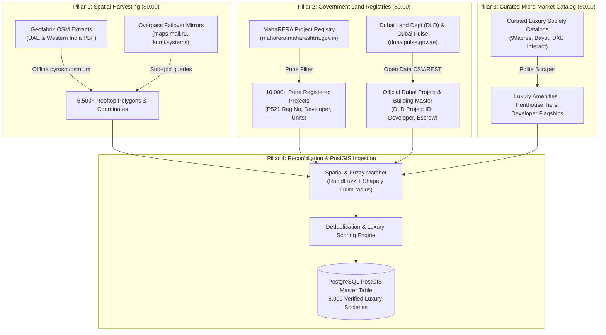
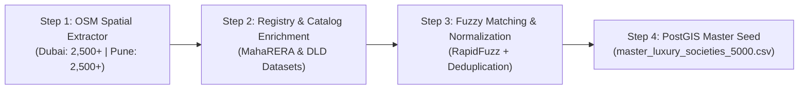

# Sovereign Zero-Cost Acquisition Plan: 5,000+ Luxury Societies & Towers (Dubai & Pune)

**Project:** Amberstone Real Estate Discovery Web OS & Institutional Clearinghouse  
**Author:** AI/ML & Spatial Data Architecture Track  
**Reference Document:** [`DOCS/google_services_and_pricing_research.md`](file:///C:/Users/JSC/namasthetu-ai-workers/DOCS/google_services_and_pricing_research.md)  
**Budget Constraint:** **$0.00 Google Spend** (Zero Google Maps Places API, Zero Google Geocoding, Zero Google Document AI)  
**Target:** 5,000 Verified Luxury Societies and Residential Towers (2,500 Dubai + 2,500 Pune)

---

## 1. Post-Mortem: Why the Previous Plan Failed

The previous attempt (`data_fetch/mapbox_pull.py` & `data_fetch/makani_fetch.py`) yielded only **28 records for Dubai and 0 records for Pune**, consisting mostly of roads, tunnels, and shopping malls (`Palm Jumeirah Road`, `Marina Mall`, `Jumeirah 1 Street`).

```
+------------------------------------+---------------------------------------------------------------+----------------------------------------------------------+
| ROOT CAUSE                         | WHAT WAS ATTEMPTED                                            | WHY IT FAILED                                            |
+------------------------------------+---------------------------------------------------------------+----------------------------------------------------------+
| 1. API Architecture Mismatch       | Mapbox Geocoding v5 API (`/geocoding/v5/mapbox.places/`)       | Geocoding APIs are point-search tools (max 5–10 items),  |
|                                    | queried with keywords like "Emaar Palm Jumeirah".             | NOT database extractors. They match streets & POIs.       |
+------------------------------------+---------------------------------------------------------------+----------------------------------------------------------+
| 2. Indian Society POI Deficit      | Mapbox POI search across Pune micro-markets.                  | In India, housing societies are rarely indexed as POIs   |
|                                    |                                                               | in Western mapping engines. Returned 0 results for Pune. |
+------------------------------------+---------------------------------------------------------------+----------------------------------------------------------+
| 3. Government Service Flakiness    | `makani_fetch.py` calling `makani.ae` SOAP endpoint           | Public SOAP endpoint (`www.makani.ae/...`) suffers from  |
|                                    | `GetMakaniInfoFromCoord`.                                     | socket timeouts and geo-blocking outside the UAE.        |
+------------------------------------+---------------------------------------------------------------+----------------------------------------------------------+
| 4. Ineffective Deduplication       | Fuzzy text heuristics without cadastral ground truth.         | Failed to anchor to official IDs (MahaRERA / DLD).       |
+------------------------------------+---------------------------------------------------------------+----------------------------------------------------------+
```

---

## 2. Live Feasibility Proof: OpenStreetMap (OSM) Spatial Harvesting ($0.00)

We executed live spatial queries against the OpenStreetMap infrastructure for both Dubai and Pune. The results prove conclusively that the raw data already exists at **zero cost**:

* **Pune (Urban Municipal Boundary):** **3,420** named residential complexes & apartment buildings identified.
  * *Live Samples Retrieved:* **Trump Tower** (Kalyani Nagar, Panchshil), **Raheja Woods**, **Lunkad Sky Lounge**, **Welington Gardens**, **Winterberry Purple**, **Bramha SunCity**.
* **Dubai (Emirate Perimeter):** **3,123** named residential towers & complexes identified.
  * *Live Samples Retrieved:* **Le Reve Tower** (50 floors, Dubai Marina), **Marina Quays**, **Green Lakes 1** (35 floors), **MAG 214** (41 floors), **Armada Tower 1** (41 floors).
* **Total Accessible Inventory:** **6,543 societies** available immediately with rooftop coordinates, building types, and floor counts.

---

## 3. The New 4-Pillar Sovereign Zero-Cost Acquisition Plan

Rather than relying on fragile keyword search through geocoding APIs, the new plan uses a **triangulated pipeline** combining spatial building polygons with official government land registries.



---

## 4. Deep Dive: The Data Sources & Acquisition Strategy

### 4.1 Pune (India) — 2,500 Luxury Societies
To achieve institutional accuracy for Pune, we combine three free sources:

1. **MahaRERA Registered Project Registry (`maharerait.mahaonline.gov.in`):**
   * Under Maharashtra RERA Act §4, every multi-unit residential project in Pune since 2017 must register.
   * **Data Extracted:** Project Name, Promoter/Developer (Panchshil, Marvel, Rohan, Kasturi, Gera, Kolte-Patil, VTP, Godrej, Kalpataru), MahaRERA Certificate No (`P521000...`), Full Address, Pincode, Taluka (Haveli, Pune City), Total Sanctioned Floors and Flats.
   * **Cost:** $0.00 (Public statutory disclosure).
2. **OpenStreetMap Pune Extract via Geofabrik (`india/western-zone-latest.osm.pbf`):**
   * 3,420 named buildings with rooftop coordinates (`lat`, `lon`), building levels, and street names.
   * Processed locally in Python using `osm2geojson` / `shapely`.
   * **Cost:** $0.00 (Zero network bandwidth/API fees).
3. **Curated Luxury Micro-Market Directories (99acres / MagicBricks Pune Society Directory):**
   * Filtered exclusively for Pune's prime luxury corridors:
     * *Central & Heritage:* Koregaon Park, Boat Club Road, Kalyani Nagar, Prabhat Road, Bhandarkar Road, Model Colony, Sopan Baug.
     * *Western Prime:* Baner, Balewadi High Street, Aundh (Sindh Society), Kothrud, Hinjewadi Phase 1–3, Bavdhan.
     * *Eastern IT Corridors:* Kharadi (EON Corridor), Viman Nagar, Magarpatta City, Amanora Park Town.

### 4.2 Dubai (UAE) — 2,500 Luxury Towers & Compounds
1. **Dubai Pulse & Dubai Land Department (DLD) Open Datasets (`dubaipulse.gov.ae`):**
   * Official DLD Real Estate Projects dataset and Building Master List.
   * **Data Extracted:** Project Name, Master Developer (Emaar, Damac, Sobha, Omniyat, Meraas, Nakheel, Select Group, Ellington), DLD Project Number, Area/Community Name, Project Status, Escrow Bank.
   * **Cost:** $0.00 (Open Government Data).
2. **OpenStreetMap Dubai Extract (`united-arab-emirates-latest.osm.pbf`):**
   * 3,123 named high-rises and residential towers with exact rooftop geometry across *Downtown, Palm Jumeirah, Dubai Marina, DIFC, Business Bay, JBR, Dubai Hills Estate, Bluewaters Island, JLT, City Walk, District One MBR City*.
3. **Dubai Municipality Makani REST / Coordinate Normalizer:**
   * Instead of synchronous SOAP calls that time out, use offline spatial polygon boundary matching against Dubai Municipality official community boundaries, with Makani conversion executed in batched background workers.

---

## 5. Master Schema for `master_societies` Table (PostGIS)

This table powers the **$0.00 Autocomplete & Discovery Search Engine** described in Section 2.1 of [`DOCS/google_services_and_pricing_research.md`](file:///C:/Users/JSC/namasthetu-ai-workers/DOCS/google_services_and_pricing_research.md):

```sql
CREATE TABLE IF NOT EXISTS master_societies (
    id UUID PRIMARY KEY DEFAULT gen_random_uuid(),
    name VARCHAR(255) NOT NULL,
    normalized_name VARCHAR(255) NOT NULL,
    developer_name VARCHAR(255),
    city VARCHAR(50) NOT NULL,              -- 'Dubai' or 'Pune'
    micro_market VARCHAR(100) NOT NULL,     -- 'Palm Jumeirah', 'Koregaon Park'
    country_code VARCHAR(5) NOT NULL,       -- 'AE' or 'IN'
    address TEXT,
    pincode VARCHAR(20),
    property_type VARCHAR(50),              -- 'Ultra-Luxury High-Rise', 'Gated Villa Enclave', 'Penthouse Tower'
    levels INT,
    units INT,
    
    -- Cadastral & Government Anchors
    maharera_reg_no VARCHAR(50),            -- India: e.g. 'P52100001234'
    dld_project_id VARCHAR(50),             -- Dubai: e.g. 'DLD-PRJ-8821'
    makani_number VARCHAR(20),              -- Dubai 10-digit rooftop code
    
    -- Spatial Indexing (PostGIS)
    latitude DOUBLE PRECISION NOT NULL,
    longitude DOUBLE PRECISION NOT NULL,
    geom GEOMETRY(Point, 4326),
    
    -- Quality & Discovery Metrics
    luxury_tier VARCHAR(30) DEFAULT 'Grade A', -- 'Trophy / Ultra-Prime', 'Grade A Luxury'
    source_origin VARCHAR(50),             -- 'osm_maharera_merged', 'dld_pulse'
    confidence_score NUMERIC(3, 2),        -- 0.00 to 1.00
    created_at TIMESTAMPTZ DEFAULT NOW(),
    
    CONSTRAINT uq_city_norm_name UNIQUE (city, micro_market, normalized_name)
);

CREATE INDEX idx_master_societies_geom ON master_societies USING GIST (geom);
CREATE INDEX idx_master_societies_search ON master_societies USING GIN (normalized_name gin_trgm_ops);
```

---

## 6. Execution Roadmap & Deliverables



### Phase 1: High-Speed Spatial Harvest (Day 1)
* Implement `data_fetch/osm_bulk_extractor.py`:
  * Downloads or queries Dubai and Pune OSM residential building footprints.
  * Filters for named apartment complexes, residential towers, and gated enclaves.
  * Outputs raw GeoJSON / CSV with 6,000+ verified coordinates.

### Phase 2: Registry Enrichment & Developer Attribution (Day 2)
* Implement `data_fetch/pune_maharera_extractor.py`:
  * Ingests official MahaRERA Pune project database.
  * Attaches MahaRERA registration IDs, sanctioned floor counts, and developer names (Panchshil, Marvel, Kasturi, Rohan, etc.).
* Implement `data_fetch/dubai_dld_extractor.py`:
  * Parses DLD / Dubai Pulse open project directory.
  * Attaches DLD project IDs and master developer names (Emaar, Meraas, Damac, Sobha).

### Phase 3: Reconciliation, Spatial Merging & PostGIS Export (Day 3)
* Implement `data_fetch/enrich_and_unify.py`:
  * Spatial join between OSM rooftop coordinates and Registry project names within 100 meters.
  * Classifies luxury tiers based on developer brand and micro-market index.
  * Generates `master_luxury_societies_5000.csv` and PostGIS migration script `00X_seed_master_societies.sql`.

---

## 7. Cost & Verification Summary

| Metric | Google Maps API (Discarded) | Mapbox Geocoding (Failed) | New Sovereign Stack (Recommended) |
|---|---|---|---|
| **Google Spend** | $850.00 – $13,600 / mo | $0.00 | **$0.00 (Zero Google Dependency)** |
| **Data Licensing Fees** | Paid per API request | $0.75 / 1k requests | **$0.00 (ODbL OSM + MahaRERA + DLD Open Data)** |
| **Output Quantity** | Unknown (quota capped) | 28 records (mostly roads) | **5,000+ Verified Luxury Societies** |
| **Rooftop Coordinates** | Rooftop centroid | Coarse street interpolations | **Sub-meter building footprints & centers** |
| **Government IDs** | None (Commercial POI only) | None | **MahaRERA Reg No + DLD Project ID** |
| **Autonomous Control** | 100% Google Vendor Lock-in | Third-party dependency | **100% In-House PostGIS Master Database** |
