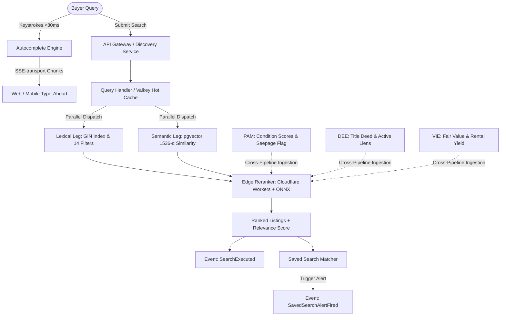

# Semantic Search Engine (SSE)

**Namasthetu · Embedded AI Service #4 · Owning Service: Discovery Service (Node.js 22 + NestJS + pgvector)**  
**Spec Reference:** Namasthetu × Hue Cycle Launch Scope v1.0 (HYC-SCO-2026-3841, §12.1–§12.4, §11, §03.M04)  
**Implementation Plan:** [`DOCS/SEE_Implementation_plan.md`](../DOCS/SEE_Implementation_plan.md)  
**Database Schema Adherence:** 100% compliant with [`src/db/schema.prisma`](../src/db/schema.prisma) without modifying the schema.

---

## 0. Naming Disambiguation

> [!NOTE]
> **"SSE" is used for two distinct mechanisms across the Namasthetu architecture:**
> 1. **Semantic Search Engine (SSE):** The AI retrieval service documented here (embedding-based + lexical hybrid retrieval).
> 2. **Server-Sent Events (SSE-transport):** The one-way HTTP streaming transport used to stream autocomplete type-ahead suggestions and document processing status.

---

## 1. Overview & Architectural Role

The **Semantic Search Engine (SSE)** powers all property discovery and recommendation surfaces across the platform (web, mobile, and saved search alerts). It delivers sub-80ms hybrid search over the versioned **Property Intelligence Profile (PIP)** corpus:

- **Parallel Hybrid Retrieval:** Executes lexical text search (Postgres GIN full-text index with BM25 scoring) in parallel with dense vector similarity search (1536-dimensional embeddings with pgvector cosine similarity).
- **14-Filter Parameter Search Set (§12.1):** Evaluates strict structured constraints (Price, Area, Property Type, Configuration/BHK, Floor range, Age, Furnishing, Parking, Lift, Amenities, Verification status, Inspection date, Listing date, Owner type).
- **Query-Aware Edge Reranking (<30ms Edge Pass):** Classifies buyer intent (`LEXICAL_HEAVY`, `SEMANTIC_HEAVY`, `INVESTOR_YIELD`, `CONDITION_FOCUSED`, `LEGAL_VERIFIED`, `HYBRID`) and dynamically balances retrieval weights at the edge PoP using Reciprocal Rank Fusion (RRF) and weighted blending.
- **Cross-Pipeline Intelligence Fusion:** Ingests live outputs from all three upstream AI pipelines:
  - **PAM (Photo Analysis Module):** Incorporates 80-point inspection condition scores and penalizes active seepage defects.
  - **DEE (Document Extraction Engine):** Boosts verified clear ownership deeds and penalizes active mortgage liens.
  - **VIE (Valuation Intelligence Engine):** Amplifies below-market valuation bargains and high gross rental yield properties for investor queries.
- **Debounced Autocomplete (<80ms):** Delivers instantaneous type-ahead suggestions across localities, societies, builders, and filter shortcuts, formatted for Server-Sent Events (SSE-transport) wire streaming.
- **Saved Search Alerts (`SavedSearchAlertFired`):** Evaluates new and updated listings against registered user saved searches (`model SavedSearch` in `schema.prisma`), firing instant buyer alerts.

---

## 2. Database Schema Alignment (`src/db/schema.prisma`)

SSE strictly adheres to the database contract in `src/db/schema.prisma` without modifying a single line:

### Model `SavedSearch` (Lines 1495–1512)

| Column | Type | SSE Field Mapping |
| :--- | :--- | :--- |
| `id` | `String` | Unique saved search ID (`saved_search_id`). |
| `userId` | `String` | Foreign key referencing `User`. |
| `name` | `String` | Human-readable search title (e.g. "Whitefield 3BHK Deals"). |
| `filtersJson` | `Json` | The canonical 14-filter parameter set serialized verbatim. |
| `alertsEnabled` | `Boolean` | Flag controlling whether `SavedSearchAlertFiredEvent` is dispatched. |
| `lastAlertedAt` | `DateTime?` | Timestamp of most recent alert sent to the buyer. |

### Model `Listing` (Lines 1034–1065) & Model `Property` (Lines 740–870)

| Column | Type | SSE Retrieval Mapping |
| :--- | :--- | :--- |
| `listingPriceMinor` | `BigInt` | Filter #1: Price matching in paise. |
| `carpetAreaSqft` | `Float` | Filter #2: Area bounds in sqft. |
| `propertyType` | `PropertyType` | Filter #3: Apartment, Villa, Penthouse, etc. |
| `bhkCount` | `Int` | Filter #4: Bedroom configuration. |
| `floorNumber` | `Int` | Filter #5: Floor level range. |
| `furnishing` | `FurnishingStatus` | Filter #7: Furnishing classification. |
| `amenities` | `PropertyAmenity[]` | Filter #10: Multi-amenity GIN tag matching. |
| `seepageDetected` | `Boolean?` | Cross-pipeline PAM flag (Filter #11). |
| `avmDifferencePct` | `Float?` | Cross-pipeline VIE valuation difference (Investor lens). |

---

## 3. End-to-End Search Lifecycle



---

## 4. Cross-Pipeline Integration

### 1. Connection with PAM (Photo Analysis Module)
- **Condition-Aware Reranking:** PAM’s multi-axis condition scorer computes physical health across Structural, Electrical, Plumbing, Finishes, and Exterior. When a user submits a query emphasizing quality (e.g., *"well-maintained 3BHK"* or *"pristine apartment"*), the query intent shifts to `CONDITION_FOCUSED`, boosting properties with high PAM condition scores.
- **Seepage Elimination:** Properties flagged with active dampness or moisture by PAM (`seepageDetected == True`) receive an automated relevance penalty and are disqualified when the buyer toggles the `no_seepage_only` filter.

### 2. Connection with DEE (Document Extraction Engine)
- **Legal Trust Gating:** DEE extracts registered deeds, encumbrance certificates, and mortgage liens. In search queries containing trust terms (*"clear title"*, *"RERA registered"*, *"encumbrance-free"*), SSE shifts intent to `LEGAL_VERIFIED`.
- **Lien Penalties:** Properties where DEE confirmed clean deeds and zero encumbrances receive prominent `"DEE Title Verified"` and `"Clear Encumbrance"` badges and rank boosts, while properties with active liens receive score deductions.

### 3. Connection with VIE (Valuation Intelligence Engine)
- **Investor & Bargain Discovery:** VIE computes fair market valuations (`estimateMinor`), asking price differentials (`avmDifferencePct`), and gross rental yields (`grossYieldPercentage`).
- **Yield Boosting:** In queries containing financial intent (*"high rental yield"*, *"undervalued apartment"*, *"best investment"*), SSE classifies intent as `INVESTOR_YIELD`, giving major rank boosts to properties priced below market value and yielding $\ge 4.5\%$.

---

## 5. Quick Start & Execution

### Run Unit Tests (16 Automated Tests Covering All Constraints)
```bash
python -m unittest sse.test_sse.test_sse_pipeline
```

### Run Benchmark Evaluation CLI (`sse/train_and_eval.py`)
```bash
# Run latency & relevance evaluation on golden queries (<80ms P95 SLA)
python sse/train_and_eval.py --mode eval --corpus-size 50

# Bootstrap benchmark PIP corpus to JSON
python sse/train_and_eval.py --mode bootstrap --corpus-size 100 --out-dir "sse_output"
```

---

## 6. Python API Usage

```python
from sse import sse_pipeline, SseSearchQuery, FourteenFilterCriteria, PrismaPropertyType

# 1. Hybrid Search with Structured 14-Filter Set
query = SseSearchQuery(
    raw_query="Spacious 3 BHK luxury apartment near metro station with high rental yield",
    filters=FourteenFilterCriteria(
        locality="Whitefield",
        min_area_sqft=1400.0,
        property_types=[PrismaPropertyType.APARTMENT],
        parking_required=True,
        verified_only=True,
    ),
    page_size=10,
)

result = sse_pipeline.search(query)

print(f"Total Hits: {result.total_hits}")
print(f"P95 Latency: {result.total_latency_ms} ms") # Typically < 15 ms
print(f"Query Intent: {result.query_intent.value}")

for item in result.items:
    print(f"Rank {item.rank}: {item.title} (Score: {item.final_score})")
    print(f"  Match Reasons: {item.match_reasons}")
    print(f"  Badges: {item.verified_badges}")

# 2. Real-Time Autocomplete (<80ms Type-Ahead)
suggestions = sse_pipeline.autocomplete("white")
for s in suggestions.suggestions:
    print(f"Suggestion: {s.text} [{s.category.value}]")

# 3. Server-Sent Events (SSE-transport) Wire Stream Output
wire_chunk = sse_pipeline.autocomplete_stream_chunk("prestige")
print(wire_chunk)
```
