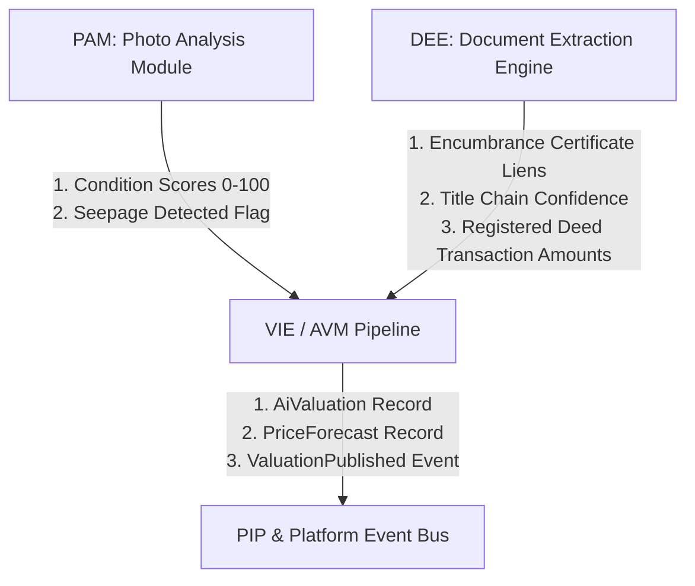

# Valuation Intelligence Engine (VIE) / Automated Valuation Model (AVM)

**Namasthetu · Embedded AI Service #3 · Owner: AI/ML Track**  
**Spec Reference:** Namasthetu × Hue Cycle Launch Scope v1.0 (HYC-SCO-2026-3841, §12.1–§12.4, §03.M05, §03.M09)  
**Implementation Plan:** [`DOCS/VIE_implementation_plan.md`](../DOCS/VIE_implementation_plan.md)  
**Database Schema Adherence:** 100% compliant with [`src/db/schema.prisma`](../src/db/schema.prisma) without modifying the schema.

---

## 1. Overview & Architectural Role

The **Valuation Intelligence Engine (VIE)** wraps the **Automated Valuation Model (AVM)** as the real-time valuation, pricing, and narrative intelligence service for Namasthetu. It is directly woven into core request paths (Property Intelligence Profile (PIP) load, Address-to-value search, and investor portfolio dashboards):

- **Core AVM Valuation (LightGBM on 13 Features):** Predicts fair market value in paise (`estimateMinor`) alongside asymmetric confidence interval bands (`confidenceLowMinor`, `confidenceHighMinor` at ±15% for Tier-1 micro-markets). Executed via an ultra-low latency edge path (<60ms P95 latency target).
- **Claude Narrative Layer:** Asynchronously generates explainable, professional natural-language valuation summaries (max 600 chars) routed through the **AI Gateway** with response caching for cost governance (§12.4).
- **Comparables Engine (Doc 03 M05):** Discovers and ranks the last 5–10 verified neighborhood sales with multi-attribute similarity scoring.
- **Hard Constraint — Owner Consent Enforcement (`consent.comparable_inclusion`):** If a property owner revokes `comparable_inclusion` consent, the property is **strictly excluded** from being queried or surfaced as a comparable.
- **Derived Real Estate Intelligence:** Computes gross rental yield %, monthly rental estimates in paise, 12-month forward price forecast time-series (model `PriceForecast`), 5-year capital appreciation projection with primary infrastructure driver, and asking price delta (`differencePercentage`).
- **Composite Multi-Axis Risk Breakdown (0–100):** Evaluates overall, market, climate, and mortgage LTV risk, integrating legal deed encumbrance data from DEE.
- **Public Address-to-Value API:** Instantaneous valuation for consumer lookups without requiring a pre-existing property entity.

---

## 2. Database Schema Alignment (`src/db/schema.prisma`)

VIE strictly adheres to the database contract in `src/db/schema.prisma` without modifying a single line:

### Model `AiValuation` (Lines 1166–1205)

| Column | Type | VIE / AVM Field Mapping |
| :--- | :--- | :--- |
| `estimateMinor` | `BigInt` | LightGBM predicted valuation in paise (`estimate_paise`). |
| `confidenceLowMinor` | `BigInt` | -15% lower confidence interval band in paise. |
| `confidenceHighMinor` | `BigInt` | +15% upper confidence interval band in paise. |
| `marketPosition` | `String` | `"BELOW_MARKET"`, `"ALIGNED"`, or `"ABOVE_MARKET"`. |
| `demandSignal` | `String` | `"COLD"`, `"WARM"`, or `"HOT"`. |
| `riskScoreOverall` | `Int` | 0–100 composite investment risk score. |
| `riskScoreLegal` | `Int` | 0–100 title & encumbrance risk (sourced from DEE). |
| `riskScoreMarket` | `Int` | 0–100 market liquidity & inventory overhang risk. |
| `riskScoreClimate` | `Int` | 0–100 climate, environmental, & seepage vulnerability. |
| `comparablesJson` | `Json?` | Top 5–10 verified neighborhood transactions with similarity scores. |
| `narrativeSummary` | `String` | Generated plain-language narrative summary (max 600 chars). |
| `listedPriceMinor` | `BigInt?` | Asking price the estimate was evaluated against. |
| `differencePercentage` | `Float?` | `(listedPrice - estimate) / estimate * 100` (-3.2 = 3.2% below). |
| `grossYieldPercentage` | `Float?` | Annual rent / property valuation %, e.g., 4.25. |
| `monthlyRentalEstimateMinor` | `BigInt?` | Projected monthly rental income in paise. |
| `projected5YrAppreciationPct` | `Float?` | 5-year capital growth forecast %, e.g., 42.5. |
| `appreciationDriver` | `String?` | Primary infrastructure growth catalyst. |
| `historicalTransactionsCount`| `Int` | Verified registered sales backing the estimate. |

### Model `PriceForecast` (Lines 1655–1668)

| Column | Type | VIE Field Mapping |
| :--- | :--- | :--- |
| `horizonMonths` | `Int` | Standard 12-month horizon. |
| `forecastJson` | `Json` | Ordered 12 monthly points: `{ month, monthName, estimateMinor, lowMinor, highMinor }`. |
| `modelVersion` | `String` | Model release tag (e.g. `"lightgbm-avm-v1.4-treelite"`). |

---

## 3. The 13 Core AVM Features

Budgeted for sub-60ms edge inference, the model consumes 13 standardized features:

| # | Feature Name | Source | Description |
|---|---|---|---|
| 1 | `area_sqft` | Property Service | Carpet / super built-up area |
| 2 | `age_years` | Property Service | Age of construction in years |
| 3 | `floor_number` | Property Service | Unit floor level |
| 4 | `total_floors` | Property Service | Total floors in the structure |
| 5 | `bhk_count` | Property Service | Bedroom count |
| 6 | `bathrooms_count` | Property Service | Bathroom count |
| 7 | `furnishing_status` | Property Service | 0=Unfurnished, 1=Semi-Furnished, 2=Fully-Furnished |
| 8 | `condition_score_overall` | **PAM Pipeline** | Physical condition score (0–100) from photo inspection |
| 9 | `seepage_detected` | **PAM Pipeline** | 1 if active dampness/seepage localized by PAM, else 0 |
| 10 | `locality_price_per_sqft_base` | Transaction Service | Base transaction benchmark (INR/sqft) for micro-market |
| 11 | `inquiry_density_score` | MIE Service | Relative buyer inquiry volume per listing (0–100) |
| 12 | `transaction_velocity_score` | MIE Service | 90-day deal closure velocity in micro-market (0–100) |
| 13 | `neighbourhood_growth_score` | MIE Service | Infrastructure, transit, & capital growth rating (0–100) |

---

## 4. Cross-Pipeline Integration



### 1. Connection with PAM (Photo Analysis Module)
- **Condition Adjustment:** PAM’s multi-axis condition scorer computes physical health across Structural, Electrical, Plumbing, Finishes, and Exterior. The aggregated condition score feeds directly as feature #8 (`condition_score_overall`). Pristine properties receive condition bonuses; degraded properties receive depreciation penalties.
- **Seepage Penalty:** PAM localizes dampness and seepage with normalized bounding boxes. If `seepageDetected == True`, feature #9 (`seepage_detected`) triggers a 6% remediation deduction and escalates `riskScoreClimate`.

### 2. Connection with DEE (Document Extraction Engine)
- **Legal Risk Integration:** DEE extracts ownership chains, survey numbers, and encumbrance certificates from registered title deeds. If DEE flags `activeLiens == True` or low OCR confidence on the title chain, VIE automatically elevates `riskScoreLegal` from standard baseline (10) up to 75, directly informing the composite `riskScoreOverall` and mortgage LTV risk for lenders.
- **Transaction Ground Truth:** DEE extracts consideration values (`sale_price_paise`) from registered conveyance deeds, which feed `TransactionCompleted` events to continuously expand VIE’s verified comparable repository and continuous learning retraining loop.

---

## 5. Quick Start & Execution

### Run Unit Tests (16 Automated Tests Covering All Constraints)
```bash
python -m unittest vie.test_vie.test_vie_pipeline
```

### Benchmark Evaluation CLI (`vie/train_and_eval.py`)
```bash
# Run benchmark accuracy evaluation across Tier-1 micro-markets
python vie/train_and_eval.py --mode eval --count 200

# Bootstrap benchmark dataset JSON
python vie/train_and_eval.py --mode bootstrap --count 250 --out-dir "vie_output"
```

---

## 6. Python API Usage

```python
from vie import vie_pipeline, PrismaFurnishingStatus

# Run full valuation
result = vie_pipeline.valuate_property(
    property_id="prop_blr_101",
    property_title="3 BHK Prestige Boulevard",
    locality="Whitefield",
    city="Bengaluru",
    area_sqft=1650.0,
    bhk_count=3,
    bathrooms_count=3,
    floor_number=8,
    total_floors=18,
    furnishing=PrismaFurnishingStatus.FULLY_FURNISHED,
    age_years=2.0,
    listed_price_paise=1500000000, # 1.50 Cr
    # Cross-pipeline inputs
    pam_condition_score=94.0,
    pam_seepage_detected=False,
    dee_legal_encumbrance_flag=False,
)

print(result.estimate_minor)          # 1487500000 paise (INR 1.48 Cr)
print(result.confidence_low_minor)    # -15% band
print(result.confidence_high_minor)   # +15% band
print(result.market_position)         # MarketPosition.ALIGNED
print(result.gross_yield_percentage)  # 5.1%
print(result.narrative_summary)       # Generated narrative under 600 chars

# Export directly to database schemas
ai_valuation_record = result.to_prisma_ai_valuation()
price_forecast_record = result.to_prisma_price_forecast()
pip_insights = result.to_pip_insights_payload()
```
