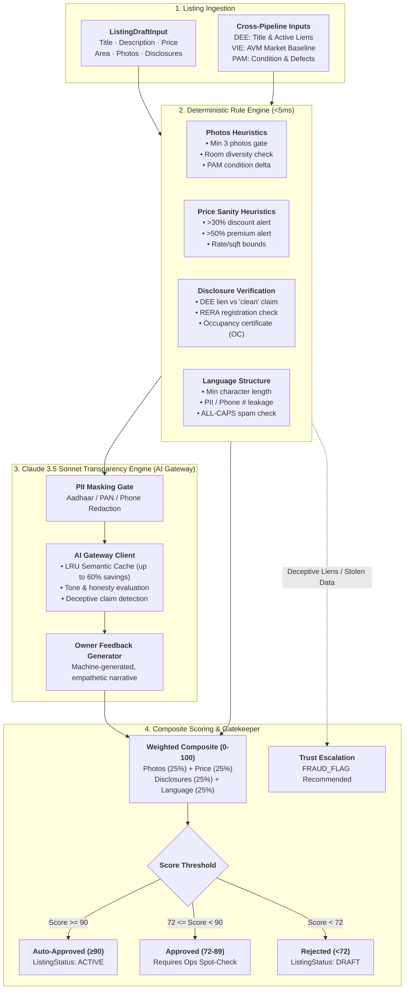
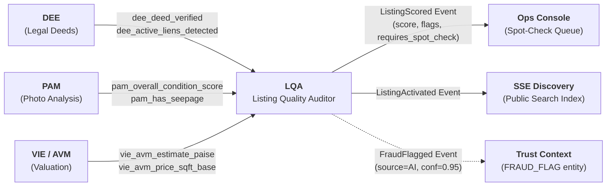

# Listing Quality Auditor (LQA) — Deep Technical Specification

**Namasthetu Embedded AI Service #5**  
**Spec Reference:** Namasthetu × Hue Cycle Launch Scope v1.0 (HYC-SCO-2026-3841, §12.1–§12.4, §8.8, §03.M09)  
**Location in Unified AI Package:** [`this_is_what_you_need/lqa`](file:///C:/Users/JSC/namasthetu-ai-workers/this_is_what_you_need/lqa)  
**Prisma Schema Adherence:** 100% compliant with [`src/db/schema.prisma`](file:///C:/Users/JSC/namasthetu-ai-workers/src/db/schema.prisma) (`model Listing`, `model LqaAudit`, `enum ListingStatus`, `enum LqaStatus`)

---

## 1. Executive Summary & Purpose

The **Listing Quality Auditor (LQA)** is the **hard state-machine gatekeeper** of the Namasthetu listing lifecycle. Unlike services that enrich or rank content already live (PAM, VIE, SSE), **no property listing reaches public searchability without clearing LQA**.

A listing submitted by an owner moves to `PENDING_APPROVAL` and triggers an asynchronous evaluation job. The LQA pipeline combines a deterministic rule engine pass with an LLM-based transparency and honesty pass (Claude 3.5 Sonnet via AI Gateway) to produce a composite quality score (0–100), structured categorised flags, and machine-generated owner feedback.

```
Owner Composes Draft ──► Submits ──► LISTING STATUS: PENDING_APPROVAL
                                                    │
                                           Async LQA Pipeline
                                       (Rule Engine + Claude LLM)
                                                    │
                                                    ▼
                           ┌──────────────────────────────────────────────────┐
                           │               LQA Scoring Decision               │
                           ├─────────────────┬────────────────┬───────────────┤
                           │  Score ≥ 90     │  Score 72–89   │  Score < 72   │
                           │  Auto-Approved  │  Spot-Check    │  Rejected     │
                           │  (skips Ops)    │  (Ops Queue)   │  (to Draft)   │
                           └────────┬────────┴────────┬───────┴───────┬───────┘
                                    │                 │               │
                                    ▼                 ▼               ▼
                              LISTING: ACTIVE    LISTING: PENDING    LISTING: DRAFT
                              (Public search)     (Awaits Ops QA)     (Feedback notes)
```

---

## 2. End-to-End Architecture & Rule vs LLM Split

LQA achieves its 5–15s async P95 latency SLA through a multi-stage hybrid architecture separating cheap deterministic heuristics from deep semantic LLM reasoning:



### 2.1 The Four Assessment Pillars

| Pillar | Weight | Deterministic Rule Engine Scope | LLM (Claude API) Scope |
| :--- | :---: | :--- | :--- |
| **1. Photos** | 25% | Presence of $\ge 3$ photos, room type coverage (kitchen, bathroom, living room), PAM defect cross-check. | Image caption verification & photo-to-text consistency (when PAM annotations are provided). |
| **2. Price** | 25% | Asking price compared against VIE/AVM algorithmic market valuation. Flags $>30\%$ discount (potential distress/fraud) or $>50\%$ premium. | Contextual justification review if owner explains below-market terms in text. |
| **3. Disclosure** | 25% | DEE cross-referencing: catches deceptive claims like *"clear title / 100% lien free"* when DEE identified active unreleased bank liens. Verifies RERA ID for apartments. | Evaluates clarity and transparency of declared defects, maintenance charges, and handover timelines. |
| **4. Language** | 25% | Description length ($\ge 60$ chars), zero PII/phone numbers (preventing platform disintermediation), spam/caps ratio. | Honesty, subjective buzzword claims (*"100% vaastu guaranteed"*), hidden caveats, readability, tone. |

---

## 3. Database Alignment with `src/db/schema.prisma`

The LQA pipeline is built to conform directly with Namasthetu's Postgres database schema without requiring schema changes:

### 3.1 Model `Listing` (`schema.prisma` lines 1035–1065)
```prisma
model Listing {
  id                    String          @id @default(uuid())
  publicId              String          @unique
  propertyId            String
  status                ListingStatus   @default(DRAFT)
  listingPriceMinor     BigInt          // Asking price in paise
  lqaScore              Int             @default(0)     // Updated by LQA (0-100)
  lqaPassed             Boolean         @default(false) // True when score >= 72
  ...
}
```

### 3.2 Model `LqaAudit` (`schema.prisma` lines 1067–1092)
```prisma
model LqaAudit {
  id                    String          @id @default(uuid())
  propertyId            String
  status                LqaStatus       @default(QUEUED)
  overallScore          Int             // 0 to 100
  breakdownJson         Json            // Flags for suspicious price, photo mismatch, missing deed
  feedbackNarrative     String?         // Owner-facing, machine-generated. Ops must not overwrite it.
  requiresSpotCheck     Boolean         @default(false) // True for 72-89 score band
  reviewedByAdminId     String?
  reviewedAt            DateTime?
  reviewNotes           String?
  evaluatedAt           DateTime        @default(now())
  updatedAt             DateTime        @default(now()) @updatedAt
  ...
}
```

The method `result.to_prisma_audit_dict()` exports a payload ready for direct insertion via Prisma Client.

---

## 4. Cross-Pipeline Integration Matrix



1. **DEE → LQA:**
   - DEE confirms whether the registered sale deed is verified.
   - If DEE flags `active_liens_detected = True` but the listing description claims *"clear title"*, LQA issues a `DECEPTIVE_TITLE_CLAIM` flag with a 65-point penalty and recommends a Trust context `FRAUD_FLAG`.
2. **VIE → LQA:**
   - VIE provides the automated fair market baseline in paise.
   - If the asking price is $>30\%$ below the AVM estimate, LQA flags `SUSPICIOUS_PRICE_DISCOUNT`.
3. **PAM → LQA:**
   - PAM provides the overall physical condition score (0–100) and moisture/seepage flags.
   - LQA ensures physical defect areas identified in PAM are disclosed rather than concealed.
4. **LQA → SSE & Discovery:**
   - Listings with LQA score $< 72$ are blocked from indexing, ensuring the search corpus only contains transparent, high-quality inventory.

---

## 5. Revision Loop & Side-by-Side Delta (§8.8)

Owners have unlimited revisions to fix flagged quality issues. LQA's `LqaRevisionTracker` retains historical audits and computes side-by-side deltas:
- `score_delta`: Difference in overall score between submissions
- `resolved_flags`: List of issue codes resolved by the revision
- `new_flags`: Newly introduced issues
- `persistent_flags`: Issues that remain unresolved

AI Gateway's in-memory caching ensures that unchanged text sections do not incur redundant LLM tokens on re-submissions (§12.4).

---

## 6. Verification & Test Suite

Run the LQA unit test suite directly:

```bash
.venv\Scripts\python.exe -m unittest this_is_what_you_need/lqa/test_lqa.py
```

Expected result:
```
..........
----------------------------------------------------------------------
Ran 10 tests in 0.006s

OK
```

Or run the full master test runner across all five AI engines:
```bash
.venv\Scripts\python.exe this_is_what_you_need/test_all.py
```
