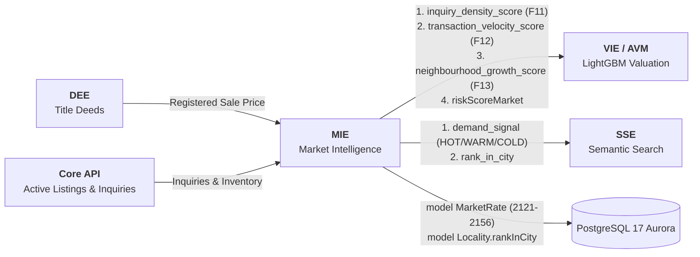

# Market Intelligence Engine (MIE) — Deep Technical Specification

**Namasthetu · Embedded AI Service #5 · Owner: AI/ML Track**  
**Package Path:** [`this_is_what_you_need/mie/`](file:///C:/Users/Srishika/namasthetu-data-ai/this_is_what_you_need/mie)  
**Spec Reference:** Namasthetu × Hue Cycle Full Launch Scope v1.0 (HYC-SCO-2026-3841, §12.1–§12.4, §03.M05, §03.M09, §11)  
**Prisma Schema Adherence:** 100% compliant with [`src/db/schema.prisma`](file:///C:/Users/Srishika/namasthetu-data-ai/src/db/schema.prisma) without modifying a single line.

---

## 1. Overview & Architectural Role

The **Market Intelligence Engine (MIE)** is the macro- and micro-market analytical substrate of the Namasthetu Real Estate Operating System. It ingests registered government transactions, live active marketplace listings, buyer inquiry telemetry, and municipal geospatial data to calculate real-time demand intensity, price velocity, neighbourhood growth, and market risks.

MIE directly powers:
1. **Features #11, #12, and #13** of the 13-feature Valuation Intelligence Engine (VIE / LightGBM AVM).
2. The **`riskScoreMarket`** component in `model AiValuation`.
3. The **`model MarketRate`** historical price and rental trends (Square Yards parity: project vs locality vs city rates per quarter).
4. **Locality city rankings** (`model Locality.rankInCity`, e.g. "Rank #1 in Bengaluru").
5. The **PIP (Property Intelligence Profile)** public/authenticated Market Radar card.

---

## 2. Database Schema Alignment (`src/db/schema.prisma`)

MIE maps directly to existing models in `src/db/schema.prisma` without schema modification:

### Model `MarketRate` (Lines 2121–2156)

| Column | Type | MIE Mapping & Source |
| :--- | :--- | :--- |
| `scope` | `MarketScope` | `CITY`, `LOCALITY`, or `SOCIETY`. |
| `scopeKey` | `String` | Unique key, e.g. `"locality:whitefield"` or `"society:sobha_clermont"`. |
| `country` | `CountryCode` | `IN` or `AE`. |
| `city` | `String` | Metropolitan city (e.g. `"Bengaluru"`, `"Mumbai"`, `"Dubai"`). |
| `localityId` | `String?` | Relates to `model Locality`. |
| `societyId` | `String?` | Relates to `model Society`. |
| `listingMode` | `ListingMode` | `BUY` (sale capital value) or `RENT` (monthly lease value). |
| `metric` | `MarketMetric` | `ASKING_RATE_PER_SQFT`, `REGISTERED_RATE_PER_SQFT`, or `MONTHLY_RENT`. |
| `configuration` | `String` | `"ALL"`, `"1 BHK"`, `"2 BHK"`, `"3 BHK"`, etc. |
| `periodType` | `MarketPeriod` | `MONTH` or `QUARTER`. |
| `periodStart` | `DateTime @db.Date` | First date of the quarter / month (e.g. `2026-04-01`). |
| `valueMinor` | `BigInt` | Stored in minor units (paise/fils) per sqft or per month. |
| `minMinor` / `maxMinor` | `BigInt?` | Range around headline rate. |
| `sampleSize` | `Int` | Number of verified transactions or active listings in the sample. |
| `source` | `String` | Provenance (e.g. `"State IGR Registry"`, `"Namasthetu listings"`). |

### Model `Locality` (Lines 2054–2089)

| Column | Type | MIE Output |
| :--- | :--- | :--- |
| `rankInCity` | `Int?` | Computed ordinal rank within the metropolitan area (e.g. `Rank #1`). |
| `rankComputedAt` | `DateTime?` | Timestamp of ranking evaluation. |

### Model `NeighbourhoodIntelligence` (Lines 1713–1755)

| Column | Type | MIE Telemetry |
| :--- | :--- | :--- |
| `metroDistanceMeters` | `Int?` | Distance to nearest operational transit station. |
| `nearestMetroName` | `String?` | Station identifier. |
| `airportDistanceMeters`| `Int?` | Road distance to international airport hub. |
| `waterSecurityIndex` | `Int?` | Municipal and ground water resilience (0–100). |
| `floodDrainageIndex` | `Int?` | 20-year rain inundation resilience (0–100). |
| `greenCanopyPercent` | `Int?` | Tree cover within 1 km radius (0–100). |
| `airQualityIndex` | `Int?` | Average annual PM2.5/AQI level. |

---

## 3. Mathematical Formulations & Underlying Logic

### 3.1 Feature #11: Inquiry Density Score (0–100)
Measures buyer inquiry concentration per active listing relative to target benchmark:

$$\lambda = \frac{N_{\text{inquiries\_30d}}}{\max(1, N_{\text{listings\_active}})}$$

$$\text{InquiryDensity} = \frac{100}{1 + \exp\left(-k \cdot (\lambda - \lambda_{\text{target}})\right)}$$

Where $k = \frac{2.4}{\lambda_{\text{target}}}$ produces a calibrated sigmoid centered at 50 for the target inquiry pace ($\lambda_{\text{target}} \approx 3.2$).

### 3.2 Feature #12: Transaction Velocity Score (0–100)
Blends deal volume with turnover speed (Days on Market, DOM):

$$V_{\text{deals}} = \min\left(2.0, \frac{N_{\text{deals\_90d}}}{\max(1, N_{\text{target\_90d}})}\right)$$

$$V_{\text{DOM}} = \text{clip}\left(\frac{\text{DOM}_{\text{target}}}{\max(10, \text{DOM}_{\text{median}})}, 0.2, 2.0\right)$$

$$\text{VelocityScore} = \text{clip}\left(50.0 \times \left(0.5 V_{\text{deals}} + 0.5 V_{\text{DOM}}\right), 5.0, 98.0\right)$$

Months of inventory overhang:
$$\text{InventoryMonths} = \frac{N_{\text{listings\_active}}}{\max(0.5, N_{\text{deals\_90d}} / 3)}$$

### 3.3 Feature #13: Neighbourhood Growth Score (0–100)
Composite rating incorporating transit proximity, civic infrastructure, and capital growth:

$$\text{GrowthScore} = 50.0 + \Delta_{\text{Metro}} + \Delta_{\text{Airport}} + \Delta_{\text{Water}} + \Delta_{\text{Flood}} + \Delta_{\text{Canopy}} + \Delta_{\text{Apprec}}$$

- $\Delta_{\text{Metro}}$: $+15$ pts ($d \le 1\text{km}$), $+10$ pts ($d \le 2.5\text{km}$), $+5$ pts ($d \le 5\text{km}$), $-4$ pts ($d > 5\text{km}$).
- $\Delta_{\text{Airport}}$: $+8$ pts ($d \le 25\text{km}$), $+4$ pts ($d \le 40\text{km}$).
- $\Delta_{\text{Water}}$: $0.15 \times (\text{Index} - 70)$.
- $\Delta_{\text{Flood}}$: $0.15 \times (\text{Index} - 75)$.
- $\Delta_{\text{Canopy}}$: $0.20 \times (\text{Percent} - 20)$.
- $\Delta_{\text{Apprec}}$: $2.0 \times (\text{AnnualGrowth\%} - 5.0)$.

### 3.4 Market Risk Index (0–100, lower is better)
Directly supplies `riskScoreMarket` to `model AiValuation`:

$$\text{MarketRisk} = 20 + \text{Risk}_{\text{Overhang}} + \text{Risk}_{\text{Dispersion}} + \text{Risk}_{\text{Liquidity}} + \text{Risk}_{\text{Momentum}}$$

- Overhang: $+25$ (if inventory $> 12\text{ months}$), $+12$ (if inventory $> 8\text{ months}$), $-5$ (if inventory $< 3\text{ months}$).
- Dispersion: $+18$ (if price $\text{CV} > 0.30$).
- Liquidity: $+20$ (if velocity $< 35$), $-8$ (if velocity $> 75$).
- Momentum: $+15$ (if quarterly growth $< -2\%$), $-5$ (if quarterly growth $> +3\%$).

---

## 4. Cross-Pipeline Integration



---

## 5. Python API Usage

```python
from this_is_what_you_need.mie import mie_pipeline, RawTransactionRecord
from datetime import date

# 1. Ingest a newly registered transaction
rate_record = mie_pipeline.ingest_transaction(
    RawTransactionRecord(
        locality="Whitefield",
        city="Bengaluru",
        registration_date=date(2026, 4, 15),
        area_sqft=1500.0,
        consideration_minor=1425000000, # Rs 1.425 Cr (9500 / sqft)
    )
)

# 2. Analyze micro-market
result = mie_pipeline.analyze_micromarket(locality="Whitefield", city="Bengaluru")

print(result.inquiry_density_score)      # Feature #11 (0-100)
print(result.transaction_velocity_score)  # Feature #12 (0-100)
print(result.neighbourhood_growth_score)  # Feature #13 (0-100)
print(result.demand_signal)               # DemandSignal.HOT / WARM / COLD
print(result.market_risk_score)           # riskScoreMarket (0-100)

# 3. Export to VIE Feature Vector
vie_features = result.to_vie_features()

# 4. Export Prisma DB Records
prisma_market_rates = result.to_prisma_market_rates()
prisma_locality_update = result.to_prisma_locality_update()
```

---

## 6. CLI Tooling: Calibration & Evaluation

```bash
# 1. Bootstrap realistic market benchmark
python this_is_what_you_need/mie/train_and_eval.py --mode bootstrap --data-path data/mie_benchmark.json --count 20

# 2. Calibrate micro-market baselines and target ratios
python this_is_what_you_need/mie/train_and_eval.py --mode train --data-path data/mie_benchmark.json --model-path this_is_what_you_need/mie/mie_model.json

# 3. Evaluate SLA latency (<30ms) and metric distributions
python this_is_what_you_need/mie/train_and_eval.py --mode eval --data-path data/mie_benchmark.json
```
